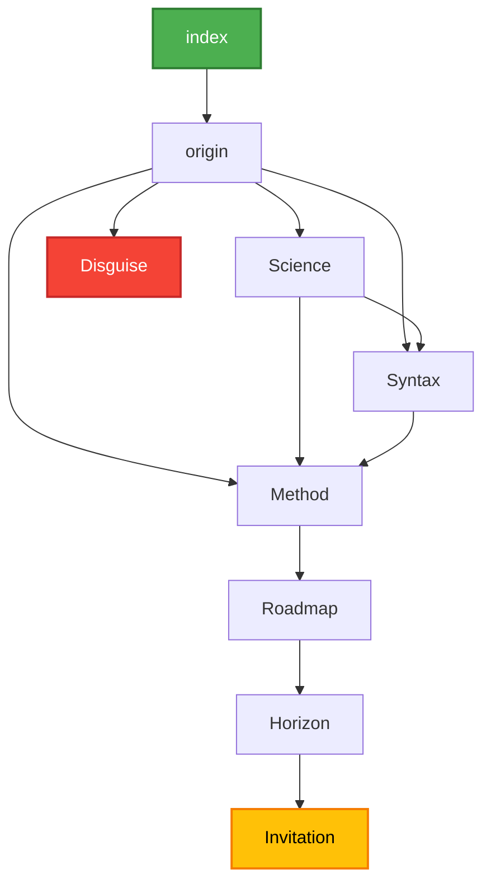

# Website Map

## Mermaid Diagram



## ASCII Representation

```
┌─────────┐
│  index  │
└────┬────┘
     │
     ▼
┌─────────┐
│ origin  │
└────┬────┘
     │
┌─────────────────────┼─────────────────────┐
│                     │                     │
▼                     ▼                     ▼
┌─────────┐     ┌─────────┐           ┌─────────┐
│ Science │     │ Syntax  │           │Disguise │
└────┬────┘     └────┬────┘           └─────────┘
     │               │                 (dead end)
     │    ┌──────────┘
     │    │
     ▼    ▼                      ▼
     └──────┴─────►┌─────────┐
                   │ Method  │
                   └────┬────┘
                        │
                        ▼
                   ┌─────────┐
                   │ Roadmap │
                   └────┬────┘
                        │
                        ▼
                   ┌─────────┐
                   │ Horizon │
                   └────┬────┘
                        │
                        ▼
                   ┌────────────┐
                   │ Invitation │
                   └────────────┘
```

## Navigation Summary

### Page Flow
- **index** → origin
- **origin** → Science, Syntax, Disguise, Method
- **Science** → Syntax, Method
- **Syntax** → Method
- **Disguise** → (dead end)
- **Method** → Roadmap → Horizon → Invitation

### Page Types

| Type | Pages |
|------|-------|
| **[Start]** | index |
| **[Hub]** | origin, Method |
| **[Dead End]** | Disguise |
| **[Final]** | Invitation |

### Node Styling (Mermaid)
- **index**: Green (#4caf50)
- **Invitation**: Yellow/Amber (#ffc107)
- **Disguise**: Red (#f44336)

## Site Structure Analysis

### Key Paths
1. **Main Path**: index → origin → Method → Roadmap → Horizon → Invitation
2. **Science Path**: index → origin → Science → Method → Roadmap → Horizon → Invitation
3. **Syntax Path**: index → origin → Syntax → Method → Roadmap → Horizon → Invitation
4. **Dead End**: index → origin → Disguise

### Hub Pages
- **origin**: Central navigation hub with 4 outgoing connections
- **Method**: Convergence point where Science and Syntax paths merge

### Flow Characteristics
- Linear progression after Method page
- Multiple entry points to Method (direct from origin, via Science, via Syntax)
- Single dead-end branch (Disguise)
- Clear start (index) and end (Invitation) points